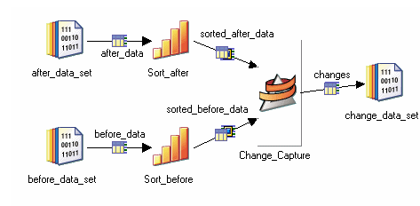

---

#### [M](https://github.com/ttltrk/TTT/blob/master/menu.md) - [FLASHCARDS](https://github.com/ttltrk/TTT/tree/master/FLASHCARDS/FLASHCARDS.md)

#### DS_FLASH

---

* [source](https://www.ibm.com/docs/en/iis/11.5?topic=jobs-processing-data)

---

* [Transformer_stage](#Transformer_stage)
* [Aggregator_stage](#Aggregator_stage)
* [](#)
* [](#)
* [](#)
* [](#)
* [](#)
* [Change_capture_stage](#Change_capture_stage)
* [](#)
* [](#)
* [](#)
* [](#)

---

```
- 01 - Transformer stage
- 02 - BASIC Transformer stage
- 03 - Aggregator stage
- 04 - Join stage
- 05 - Merge Stage
- 06 - Lookup Stage
- 07 - Sort stage
- 08 - Funnel Stage
- 09 - Remove Duplicates Stage
- 10 - Compress stage
- 11 - Expand Stage
- 12 - Copy stage
- 13 - Modify stage
- 14 - Filter Stage
- 15 - External Filter stage
- 16 - Change Capture stage
- 17 - Change Apply stage
- 18 - Difference stage
- 19 - Compare stage
- 20 - Encode Stage
- 21 - Switch stage
- 22 - FTP Enterprise Stage
- 23 - Generic stage
- 24 - Surrogate Key Generator stage
- 25 - Slowly Changing Dimension stage
- 26 - Pivot Enterprise stage
- 27 - Checksum stage
```

---

#### Transformer_stage

Transformer stages allow you to create transformations to apply to your data.
These transformations can be simple or complex and can be applied to individual columns in your data. Transformations are specified using a set of functions. For more information,
see Parallel transform functions.

Transformer stages can have a single input and any number of outputs.
It can also have a reject link that takes any rows which have not been written
to any of the outputs links by reason of a write failure
or expression evaluation failure.


[^^^](#DS_FLASH)

---

#### Aggregator_stage

The Aggregator stage is a processing stage. It classifies data rows from a single input link into groups and computes totals or other aggregate functions for each group. The aggregator stage gives you access to grouping and summary operations.

The Aggregator stage is a processing stage. It classifies data rows from a single input link into groups and computes totals or other aggregate functions for each group. The summed totals for each group are output from the stage via an output link.

[^^^](#DS_FLASH)

---

####

[^^^](#DS_FLASH)

---

####

[^^^](#DS_FLASH)

---

####

[^^^](#DS_FLASH)

---

#### Change_capture_stage

[source](#https://www.ibm.com/docs/en/iis/11.5?topic=data-change-capture-stage)

The Change Capture stage is a processing stage that compares two data sets and makes a record of the differences.
The Change Capture Stage is a processing stage. The stage compares two data sets and makes a record of the differences.

The stage assumes that the incoming data is key-partitioned and sorted in ascending order.



[^^^](#DS_FLASH)

---

####

[^^^](#DS_FLASH)

---

####

[^^^](#DS_FLASH)

---

####

[^^^](#DS_FLASH)

---

####

[^^^](#DS_FLASH)

---
