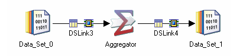

---

#### [M](https://github.com/ttltrk/TTT/blob/master/menu.md) - [FLASHCARDS](https://github.com/ttltrk/TTT/tree/master/FLASHCARDS/FLASHCARDS.md)

#### DS_FLASH

---

* [source](https://www.ibm.com/docs/en/iis/11.5?topic=jobs-processing-data)

---

* [Transformer_stage](#Transformer_stage)
* [Aggregator_stage](#Aggregator_stage)
* [Join_stage](#Join_stage)
* [](#)
* [Lookup_stage](#Lookup_stage)
* [](#)
* [](#)
* [Filter_stage](#Filter_stage)
* [](#)
* [](#)
* [Change_capture_stage](#Change_capture_stage)
* [](#)
* [](#)
* [](#)
* [](#)
* [](#)
* [](#)
* [Checksum_stage](#Checksum_stage)

---

```
- 01 - Transformer stage
- 02 - BASIC Transformer stage
- 03 - Aggregator stage
- 04 - Join stage
- 05 - Merge Stage
- 06 - Lookup Stage
- 07 - Sort stage
- 08 - Funnel Stage
- 09 - Remove Duplicates Stage
- 10 - Compress stage
- 11 - Expand Stage
- 12 - Copy stage
- 13 - Modify stage
- 14 - Filter Stage
- 15 - External Filter stage
- 16 - Change Capture stage
- 17 - Change Apply stage
- 18 - Difference stage
- 19 - Compare stage
- 20 - Encode Stage
- 21 - Switch stage
- 22 - FTP Enterprise Stage
- 23 - Generic stage
- 24 - Surrogate Key Generator stage
- 25 - Slowly Changing Dimension stage
- 26 - Pivot Enterprise stage
- 27 - Checksum stage
```

---

#### Transformer_stage

Transformer stages allow you to create transformations to apply to your data.
These transformations can be simple or complex and can be applied to individual columns in your data. Transformations are specified using a set of functions. For more information,
see Parallel transform functions.

Transformer stages can have a single input and any number of outputs.
It can also have a reject link that takes any rows which have not been written
to any of the outputs links by reason of a write failure
or expression evaluation failure.


[^^^](#DS_FLASH)

---

#### Aggregator_stage

The Aggregator stage is a processing stage. It classifies data rows from a single input link into groups and computes totals or other aggregate functions for each group. The aggregator stage gives you access to grouping and summary operations.

The Aggregator stage is a processing stage. It classifies data rows from a single input link into groups and computes totals or other aggregate functions for each group. The summed totals for each group are output from the stage via an output link.



[^^^](#DS_FLASH)

---

#### Join_stage

[source](https://www.ibm.com/docs/en/iis/11.7?topic=data-join-stage)

The Join stage is a processing stage that performs join operations on two or more data sets input to the stage and then outputs the resulting data set.
The Join stage is one of three stages that join tables based on the values of key columns. The other two are:

- Lookup Stage
- Merge Stage

The three stages differ mainly in the memory they use, the treatment of rows with unmatched keys, and their requirements for data being input (for example, whether it is sorted). 
In the Join stage, the input data sets are notionally identified as the "right" set and the "left" set, and "intermediate" sets. You can specify which is which. It has any number of input links and a single output link.


[^^^](#DS_FLASH)

---

####

[^^^](#DS_FLASH)

---

#### Lookup_stage

[source](https://www.ibm.com/docs/en/iis/11.7?topic=data-lookup-stage)

The Lookup stage is a processing stage that is used to perform lookup operations on a data set read into memory from any other Parallel job stage that can output data. The most common use for a lookup is to map short codes in the input data set onto expanded information from a lookup table which is then joined to the incoming data and output.

The most common use for a lookup is to map short codes in the input data set onto expanded information from a lookup table which is then joined to the incoming data and output. For example, you could have an input data set carrying names and addresses of your U.S. customers. The data as presented identifies state as a two letter U. S. state postal code, but you want the data to carry the full name of the state. You could define a lookup table that carries a list of codes matched to states, defining the code as the key column. As the Lookup stage reads each line, it uses the key to look up the state in the lookup table. It adds the state to a new column defined for the output link, and so the full state name is added to each address. If any state codes have been incorrectly entered in the data set, the code will not be found in the lookup table, and so that record will be rejected.

Lookups can also be used for validation of a row. If there is no corresponding entry in a lookup table to the key's values, the row is rejected.


[^^^](#DS_FLASH)

---

####

[^^^](#DS_FLASH)

---

####

[^^^](#DS_FLASH)

---

####

[^^^](#DS_FLASH)

---

####

[^^^](#DS_FLASH)

---

#### Filter_stage

[source](https://www.ibm.com/docs/en/iis/11.7?topic=data-filter-stage)

The Filter stage is a processing stage. This stage transfers, unmodified, the records of the input data set which satisfy the specified requirements and filters out all other records.

The Filter stage is a processing stage. It can have a single input link and a any number of output links and, optionally, a single reject link.


[^^^](#DS_FLASH)

---

####

[^^^](#DS_FLASH)

---

#### Change_capture_stage

[source](#https://www.ibm.com/docs/en/iis/11.5?topic=data-change-capture-stage)

The Change Capture stage is a processing stage that compares two data sets and makes a record of the differences.
The Change Capture Stage is a processing stage. The stage compares two data sets and makes a record of the differences.

The stage assumes that the incoming data is key-partitioned and sorted in ascending order.


[^^^](#DS_FLASH)

---

####

[^^^](#DS_FLASH)

---

####

[^^^](#DS_FLASH)

---

####

[^^^](#DS_FLASH)

---

####

[^^^](#DS_FLASH)

---

####

[^^^](#DS_FLASH)

---

####

[^^^](#DS_FLASH)

---

####

[^^^](#DS_FLASH)

---

#### Checksum_stage

[source](https://www.ibm.com/docs/en/iis/11.5?topic=data-checksum-stage)

You can use the checksum value to check the validity of each row when it is written to the data target. If the checksum value does not equate to the columns from which it was generated, then the data is corrupt and is no longer valid.

Typically you create the Checksum stage in one job to add the checksum column, and then use a Checksum stage in another job to check the validity of the data.

[^^^](#DS_FLASH)

---