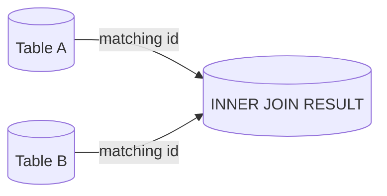
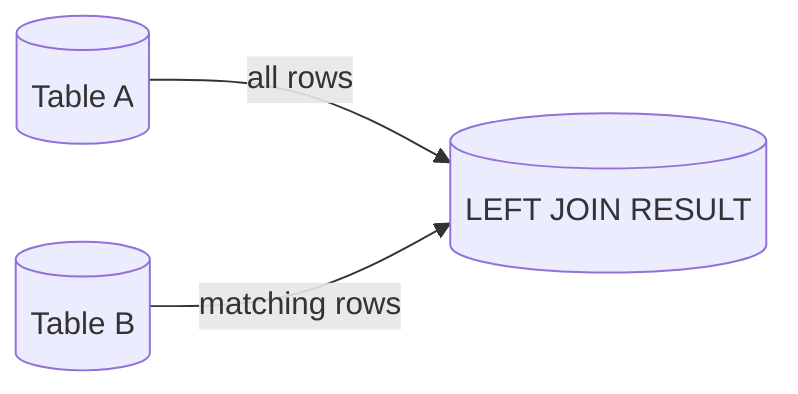
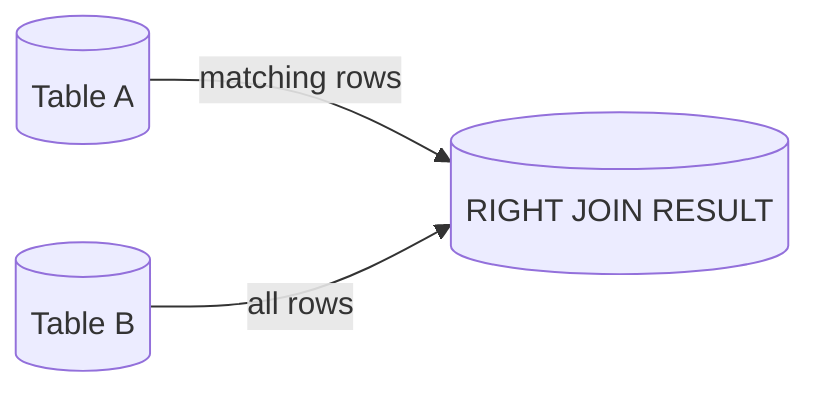
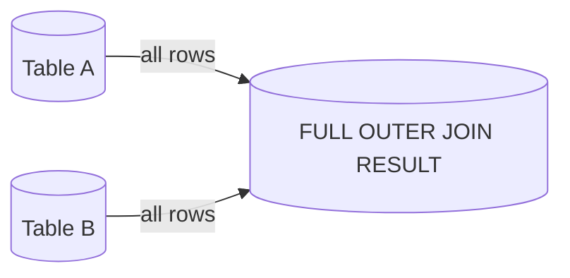

---

#### [M](https://github.com/ttltrk/TTT/blob/master/menu.md) - [FLASHCARDS](https://github.com/ttltrk/TTT/tree/master/FLASHCARDS/FLASHCARDS.md) 

---

### SQL_JOIN_FLASH

---

* [INNER_JOIN](#INNER_JOIN)
* [LEFT_JOIN](#LEFT_JOIN)
* [RIGHT_JOIN](#RIGHT_JOIN)
* [FULL_OUTER_JOIN](#FULL_OUTER_JOIN)
  
---

#### INNER_JOIN

```
Returns only matching rows in both tables.
```

```sql
select preferred_columns
from tab_a a
inner join tab_b b
on a.key = b.key
```



[^^^](#SQL_JOIN_FLASH)

---

#### LEFT_JOIN

```
Returns all rows from A + matching rows from B.
```

```sql
select preferred_columns
from tab_a a
left join tab_b b
on a.key = b.key
```

```sql
select preferred_columns
from tab_a a
left join tab_b b
on a.key = b.key
where b.key is null
```



[^^^](#SQL_JOIN_FLASH)

---

#### RIGHT_JOIN

```
Returns all rows from B + matching rows from A.
```

```sql
select preferred_columns
from tab_a a
right join tab_b b
on a.key = b.key
```

```sql
select preferred_columns
from tab_a a
right join tab_b b
on a.key = b.key
where a.key is null
```



[^^^](#SQL_JOIN_FLASH)

---

#### FULL_OUTER_JOIN

```
Returns all rows from both tables, matched where possible.
```



[^^^](#SQL_JOIN_FLASH)

---
