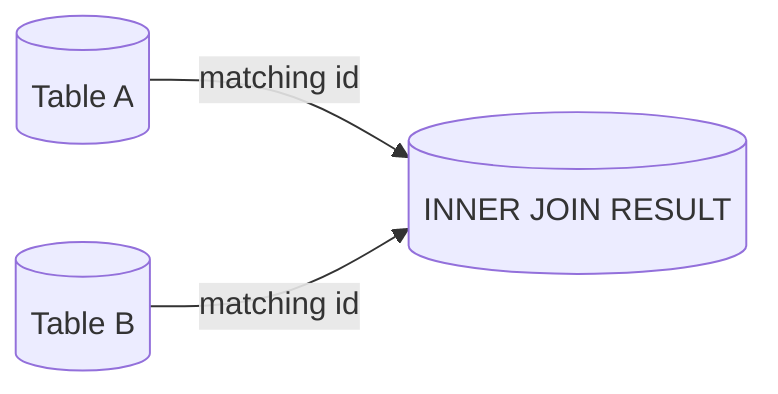
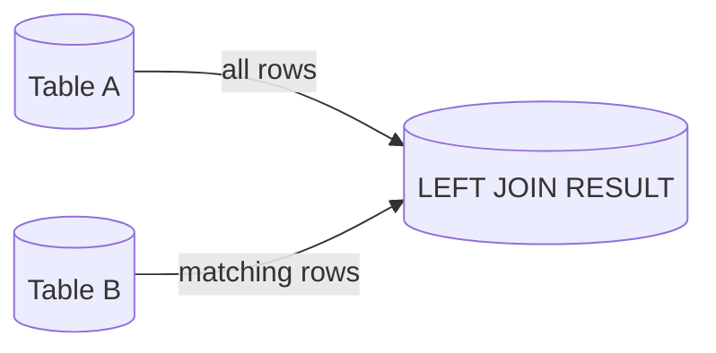
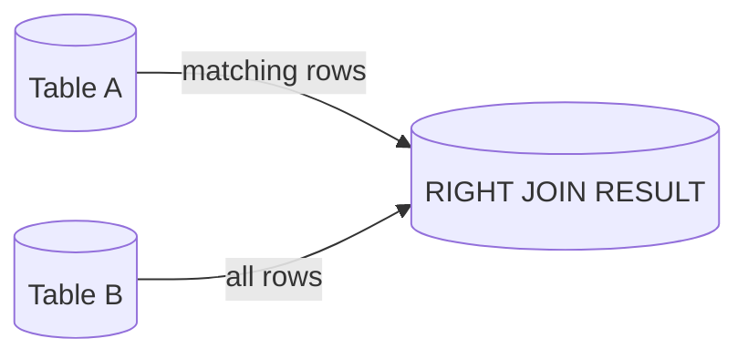
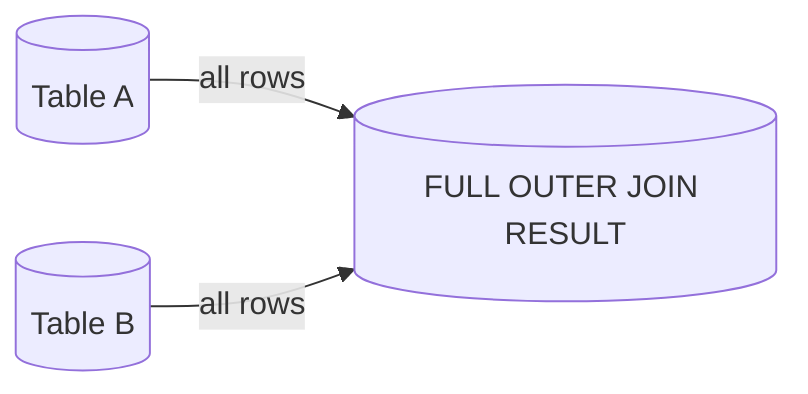

---

#### INNER JOIN

```mermaid
flowchart LR
    A[(Table A)]
    B[(Table B)]
    A -->|matching id| C[(INNER JOIN RESULT)]
    B -->|matching id| C
```

---

#### LEFT JOIN

```mermaid
flowchart LR
    A[(Table A)]
    B[(Table B)]
    A -->|all rows| C[(LEFT JOIN RESULT)]
    B -->|matching rows| C
```

---

#### RIGHT JOIN

```mermaid
flowchart LR
    A[(Table A)]
    B[(Table B)]
    A -->|matching rows| C[(RIGHT JOIN RESULT)]
    B -->|all rows| C
```

---

#### FULL OUTER JOIN

```mermaid
flowchart LR
    A[(Table A)]
    B[(Table B)]
    A -->|all rows| C[(FULL OUTER JOIN RESULT)]
    B -->|all rows| C
```

---
