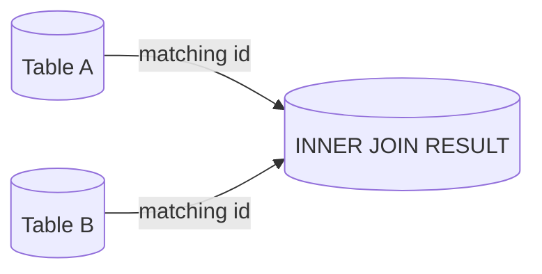
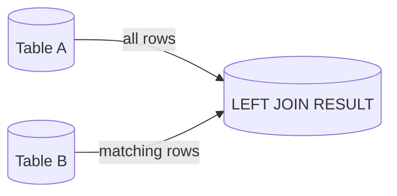
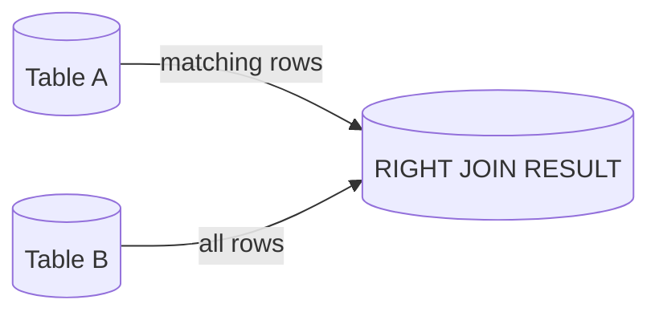
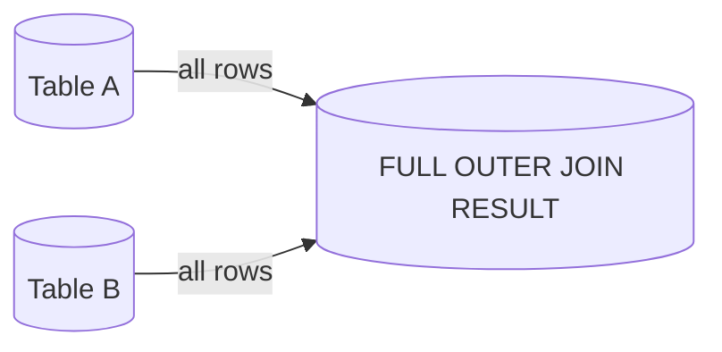

---

#### INNER JOIN

```
Returns only matching rows in both tables.
```



---

#### LEFT JOIN

```
Returns all rows from A + matching rows from B.
```



---

#### RIGHT JOIN

```
Returns all rows from B + matching rows from A.
```



---

#### FULL OUTER JOIN

```
Returns all rows from both tables, matched where possible.
```



---
