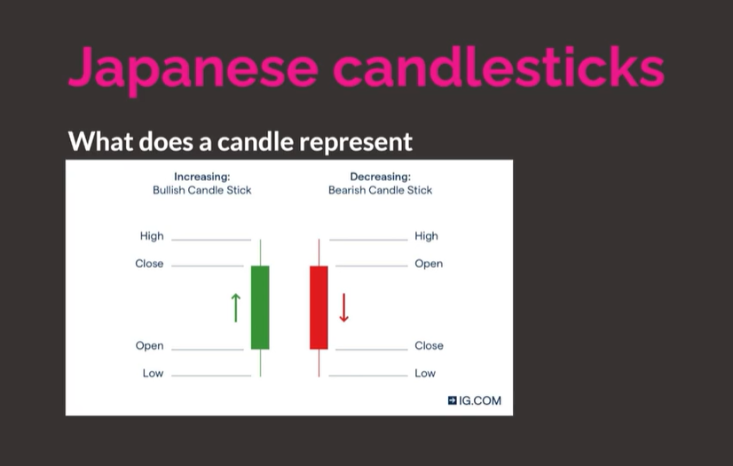

---

#### [M](https://github.com/ttltrk/TTT/blob/master/menu.md)

---

### FX

---

- RULES

1. TP: 20 / SL: 10
2. TP: 2% / SL: 1%
3. daily 10 pip min
4. always wait for the backtest
5. sma + rsi

---

#### STEP_01

##### BEGINNER_FX_EDU

What is forex?

```
Forex = Foreign exchange

Most international airports have a currency exchange kiosk available to travelers.

Trading one currency for a different currency.

ex: Traveling to Mexico from US exchange rate is 20:1, 6.6 trillion dollars day in volume.
```

Major currencies:

```
USD, EUR, GBP, JPY, NZD, CHF, CAD
```

How do you trade forex?

```
Intro to trading forex happens at the airport.
Daytrading happens once you get a broker. 
When trading you buy or sell in currency pairs (EUR/USD)
```

Major pairs:

```
EUR/USD, USD/JPY, GBP/USD, USD/CAD, USD/CHF, AUD/USD, NZD/USD
```

Buying and selling

```
Buying: Purchasing EUR/USD at 1.3 and then selling it at a higher price, for example 1.4

Selling: Also know as a short. Basically you borrow EUR/USD at the Current Price 1.3 and then return the amount
you borrowed at a lower price 1.2. Making a profit from the difference.
```

Selling or Shorting

```
1.
Borrowed a Bag of sugar from your friend Greg.
Current value is 3$
Winter Time

2.
SOLD
Value at 3$
Wait a few months Until sugar is cheaper in summer 

3.
Returned a bag of sugar to your friend Greg
Current values is 1$
Summer Time 

final = 2.00$ Profit
```

Who trades forex?

```
A majority of the trading Volume is Banks and financial instituions.
Total 6.6$ Trillion

Day traders (Normal people) less than 3% (200 billion)

Logically you want to trade with the banks (advanced)
```

!!!!!!!!!!!!!!!!!!!!!!!!!!!!!!!!!!!!!!!!!!!!!!!!!!!!!!!!!!!!!!!!!!!!!!
Why trade forex?
!!!!!!!!!!!!!!!!!!!!!!!!!!!!!!!!!!!!!!!!!!!!!!!!!!!!!!!!!!!!!!!!!!!!!!

```
Day trading forex allows you to analyse charts from home and make trades
based on where you think the price will go.

This allows you to make money for yourself instead of working a regular 9-5 job 
where you exchange your time for a paycheck.

The amount you can earn is exponentially more than normal careers.
```

Getting started INFO OVERLOAD

```
You need a broker (the middle man)

Allows you to trade any asset (forex, crypto, stocks)

Trading lots and sizes of positions

In pips units of measure

Buying and selling

Broker gives access to mt4 platform for placing trades
```

Pips and how to calculate them

```
Pips in forex trading is a unit of measure used to determine how much the price has gone up or down.

A single pip is based on the 4th decimal point of the price in the currency pair.

Ex: EUR/USD price is currently 1.14437, if the price went up 1 pip the price would be 1.14447
```

Pips and how to calculate them

```
Pips continued:

current price of EUR/USD: 	1.14437
10 pip movement:			1.14537
20 pip movement:			1.14637
100 pip movement:			1.15437
1000 pip movement: 			1.24437
```

Lots explained:

```
Lots are basically the size of you trade

For example with stocks like tesla or facebook you would buy 1 share at the current price
and sell it at a higher price.

Lots in forex are also units of measure.

micro lot = 1 000 units
mini lot = 10 000 units
standard lot = 100 000 units

1 standard lot of EUR/USD in 100 000 units

At a price of 1.14437 x 100 000 units you would need 114 437$ USD to place that trade.

Thats where margin/leverage trading comes into play.
```

Lots continued

```
if you trade 1 standard lot (1.00)

Of EUR/USD at 1.14437 which is 100 000 units.
Total dollar value would be 114 437$ dollars
if the price went up 20 pips. 0.00200 to 1.14637
it would be a total dollar value of 114637$
netting you a total profit of 200$ from your trade.

114637 - 114437 = 200

So from this you can calculate how much you could earn with a large or smaller size trade.

10 000 lots = 2 000$
0.01 lots = 2$
```

Margin/Leverage trading basics

```
Understanding how your margin account works 

Initial deposit into your brokerage account multiplied by the leverage that your borker offers.
USA standard is 1:30 leverage but there are some brokers that give 1:500. Don't go higher.
So..a 1000$ deposit with 1:500 would give you buying power of 500 000$.

So if your account is 1000$ but you have buying power of 500 000$ and you are in a losing position,
you can not go down below a 1000$ loss because your broker will margin call account.

This is why proper risk management is essential when day trading.

Recommended risk per trade is 1% of your account balance (10$) on a 1000$ account.
```

Margin/Leverage continued

```
Margin requirement for each currency pair are different.

ex: EUR/USD is 2% and GB/USD is 5%

Additionally each broker has different margin requirements.

To buy or sell a 100 000 of EUR/USD without leverage would requeire you to put up
100 000$ in your account, the full value of the position.

But with a margin requirement of 2% only 2000$ of your funds would be required to open 
that same position.

1 Standard lot 1.00 (100 000 units) = 2000$ Margin
1 Mini lot 0.1 (10 000 units) = 200$ Margin
1 Micro lot 0.01 (1000 units) = 20$ Margin

All of these examples are with a 2% margin requirement.

But if your trade falls below your margin requirement, your broker will execute a margin call
on your trade, automatically closing your position as you don't have enough funds to cover 
the trade.

This is known as BLOWING your account.
```

Forex brokers 101

```
The middle man
Place trades through them
You will deposit money into your trading account with them...then
They will give you a username and password to access mt4 mt5 and/or ctrader

Basic functions of a broker are as follows:

Deposit/withdraw your money to/from them
They give you access to trading with that money via mt4
You won't be spending too much time on your brokers website.
Only while transferring or withdrawing.
```

Type of charts

```
All of which you can find on the most popular website for looking at
charts which is TradingView

TradingView.com
```

Japanese candlesticks



[^^^](#FX)

---

##### TRADING_VIEW_TUTORIAL

[^^^](#FX)

---

##### ARTYS_BROKER_OF_CHOICE

[^^^](#FX)

---

##### STEP_01_QUIZ

[^^^](#FX)

---

#### STEP_02

##### INTERMEDIATE_TRADING_EDU

[^^^](#FX)

---

##### STEP_02_QUIZ

[^^^](#FX)

---

#####

[^^^](#FX)

---

#####

[^^^](#FX)

---

#### STEP_03

#####

[^^^](#FX)

---

#####

[^^^](#FX)

---

#####

[^^^](#FX)

---

#####

[^^^](#FX)

---

#####

[^^^](#FX)

---

#####

[^^^](#FX)

---

```
1. What is the function of an Oscillator Indicator?
- Identify when something is overbought or oversold

2. When is the momentum of a trend at its greatest?
- As the trend begins

3. Which pattern is NOT an example of a continuation pattern?
- Bearish Double Top

4. Which pattern is an example of a reversal pattern?
- Bearish Triple Top

5. Which candlestick pattern is bullish?
- Hammer

6. What is the main use of a Pivot Point?
- Potential market turning points

7. What is the main benefit of Heikin-Ashi candles?
- Improving readability of candlestick charts and trend analysis

8. What does Elliot Wave Analysis look for?
- Recurrent long-term price patterns

9. Which mathematical concept is Harmonic Price Patterns based on?
- Fibonacci numbers

10 - Which type of indication does Divergence count as?
Leading Indicator

11. What’s the term for a market that is moving sideways?
- Ranging market

12. When is the strongest movement likely to occur in the market?
- On a breakout

13. Why is a fakeout dangerous to traders?
- Can result in significant losses

14. Which one is a significant piece of fundamental news?
- Non-Farm Payroll (NFP)
```

[^^^](#FX)

---
