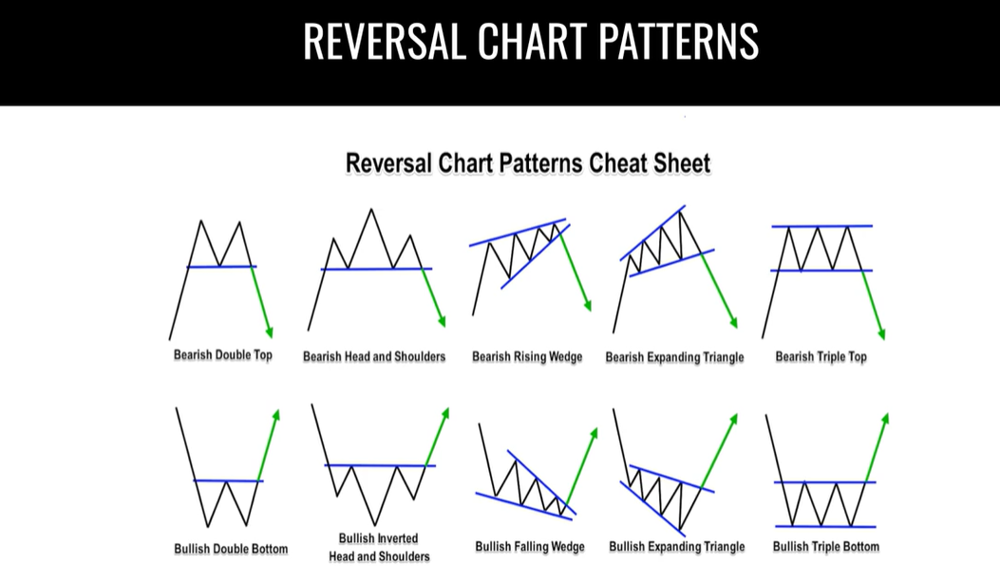

---

#### [M](https://github.com/ttltrk/TTT/blob/master/menu.md)

---

### FX

---

* [FX_DAILY_CHECK](https://github.com/ttltrk/TTT/blob/master/FX/FX_DAILY_CHECK/FX_DAILY_CHECK.md)

---

- RULES

1. no manager, no corp
2. own time, make faster make more
3. no tech between, directly make money

1. TP: 20 / SL: 10
2. TP: 2% / SL: 1%
3. daily 10 pip min
4. always wait for the backtest
5. sma + rsi

1. 100eur/day | 500eur/week | 2000eur/month

---

#### STEP_01

##### BEGINNER_FX_EDU

What is forex?

```
Forex = Foreign exchange

Most international airports have a currency exchange kiosk available to travelers.

Trading one currency for a different currency.

ex: Traveling to Mexico from US exchange rate is 20:1, 6.6 trillion dollars day in volume.
```

Major currencies:

```
USD, EUR, GBP, JPY, NZD, CHF, CAD
```

How do you trade forex?

```
Intro to trading forex happens at the airport.
Daytrading happens once you get a broker. 
When trading you buy or sell in currency pairs (EUR/USD)
```

Major pairs:

```
EUR/USD, USD/JPY, GBP/USD, USD/CAD, USD/CHF, AUD/USD, NZD/USD
```

Buying and selling

```
Buying: Purchasing EUR/USD at 1.3 and then selling it at a higher price, for example 1.4

Selling: Also know as a short. Basically you borrow EUR/USD at the Current Price 1.3 and then return the amount
you borrowed at a lower price 1.2. Making a profit from the difference.
```

Selling or Shorting

```
1.
Borrowed a Bag of sugar from your friend Greg.
Current value is 3$
Winter Time

2.
SOLD
Value at 3$
Wait a few months Until sugar is cheaper in summer 

3.
Returned a bag of sugar to your friend Greg
Current values is 1$
Summer Time 

final = 2.00$ Profit
```

Who trades forex?

```
A majority of the trading Volume is Banks and financial instituions.
Total 6.6$ Trillion

Day traders (Normal people) less than 3% (200 billion)

Logically you want to trade with the banks (advanced)
```

!!!!!!!!!!!!!!!!!!!!!!!!!!!!!!!!!!!!!!!!!!!!!!!!!!!!!!!!!!!!!!!!!!!!!!
Why trade forex?
!!!!!!!!!!!!!!!!!!!!!!!!!!!!!!!!!!!!!!!!!!!!!!!!!!!!!!!!!!!!!!!!!!!!!!

```
Day trading forex allows you to analyse charts from home and make trades
based on where you think the price will go.

This allows you to make money for yourself instead of working a regular 9-5 job 
where you exchange your time for a paycheck.

The amount you can earn is exponentially more than normal careers.
```

Getting started INFO OVERLOAD

```
You need a broker (the middle man)

Allows you to trade any asset (forex, crypto, stocks)

Trading lots and sizes of positions

In pips units of measure

Buying and selling

Broker gives access to mt4 platform for placing trades
```

Pips and how to calculate them

```
Pips in forex trading is a unit of measure used to determine how much the price has gone up or down.

A single pip is based on the 4th decimal point of the price in the currency pair.

Ex: EUR/USD price is currently 1.14437, if the price went up 1 pip the price would be 1.14447
```

Pips and how to calculate them

```
Pips continued:

current price of EUR/USD: 	1.14437
10 pip movement:			1.14537
20 pip movement:			1.14637
100 pip movement:			1.15437
1000 pip movement: 			1.24437
```

Lots explained:

```
Lots are basically the size of you trade

For example with stocks like tesla or facebook you would buy 1 share at the current price
and sell it at a higher price.

Lots in forex are also units of measure.

micro lot = 1 000 units
mini lot = 10 000 units
standard lot = 100 000 units

1 standard lot of EUR/USD in 100 000 units

At a price of 1.14437 x 100 000 units you would need 114 437$ USD to place that trade.

Thats where margin/leverage trading comes into play.
```

Lots continued

```
if you trade 1 standard lot (1.00)

Of EUR/USD at 1.14437 which is 100 000 units.
Total dollar value would be 114 437$ dollars
if the price went up 20 pips. 0.00200 to 1.14637
it would be a total dollar value of 114637$
netting you a total profit of 200$ from your trade.

114637 - 114437 = 200

So from this you can calculate how much you could earn with a large or smaller size trade.

10 000 lots = 2 000$
0.01 lots = 2$
```

Margin/Leverage trading basics

```
Understanding how your margin account works 

Initial deposit into your brokerage account multiplied by the leverage that your borker offers.
USA standard is 1:30 leverage but there are some brokers that give 1:500. Don't go higher.
So..a 1000$ deposit with 1:500 would give you buying power of 500 000$.

So if your account is 1000$ but you have buying power of 500 000$ and you are in a losing position,
you can not go down below a 1000$ loss because your broker will margin call account.

This is why proper risk management is essential when day trading.

Recommended risk per trade is 1% of your account balance (10$) on a 1000$ account.
```

Margin/Leverage continued

```
Margin requirement for each currency pair are different.

ex: EUR/USD is 2% and GB/USD is 5%

Additionally each broker has different margin requirements.

To buy or sell a 100 000 of EUR/USD without leverage would requeire you to put up
100 000$ in your account, the full value of the position.

But with a margin requirement of 2% only 2000$ of your funds would be required to open 
that same position.

1 Standard lot 1.00 (100 000 units) = 2000$ Margin
1 Mini lot 0.1 (10 000 units) = 200$ Margin
1 Micro lot 0.01 (1000 units) = 20$ Margin

All of these examples are with a 2% margin requirement.

But if your trade falls below your margin requirement, your broker will execute a margin call
on your trade, automatically closing your position as you don't have enough funds to cover 
the trade.

This is known as BLOWING your account.
```

Forex brokers 101

```
The middle man
Place trades through them
You will deposit money into your trading account with them...then
They will give you a username and password to access mt4 mt5 and/or ctrader

Basic functions of a broker are as follows:

Deposit/withdraw your money to/from them
They give you access to trading with that money via mt4
You won't be spending too much time on your brokers website.
Only while transferring or withdrawing.
```

Type of charts

```
All of which you can find on the most popular website for looking at
charts which is TradingView

TradingView.com
```

Japanese candlesticks


```
Time frames: 1m, 3m, 5m, 15m, 1h, 4h, 1d, 1w
Each candles is made of candles from a smaller time frame
3 5m candles make up a 15m candle 
```


Identifying a trend line

```
As price moves up to create higher lows and higher highs you will begin
to see that the lows can be connected using a trend line.

Conversely

As price moves down to create lower highs and lower lows you will begin
to see that the highs can be connected using a trend line.
```

Support and resistance levels

```
Zooming out the chart even more and on a higher
time frame (1H or 1D) recommended

You will see certain price points where the price always reverses.

These are known as support and resistance
```

Popular chart indicators

```
Moving Averages

RSI (relative strength index) or stochastic rsi

VWAP (volume weighted average price)
```
Sessions

```
3 main sessions (New York, London, Tokyo)
```

!!!!!!!!!!!!!!!!!!!!!!!!!!!!!!!!!!!!!!!!!!!!!!!!!!!!!!!!!!!!!!!!!!!!!!
Moving averages
!!!!!!!!!!!!!!!!!!!!!!!!!!!!!!!!!!!!!!!!!!!!!!!!!!!!!!!!!!!!!!!!!!!!!!

```
There are 4 types of moving averages

Simple, Exponential, Smoothed, Weighted

Basically it is the average that the price of the asset should be at!!

200 Moving average is most important!!

If the price of the asset you are trading is too far away from the 200
moving average, the probability that it will go the opposite direction
towards the 200 is most likely

200 can also be used as a trend line

above the 200 we are in an up trend
below the 200 we are in a down trend

Using multiple moving averages at different ranges is common.

21, 50, 100, 200

During a strong trend, price is likely to reject off the 21 moving average

As the trend weakens it will go to the bigger moving averages.

the GDP is wants to be at 200 MA, but the buyers always pushing it up 
```


RSI (Relative Strength Index)


```
Warning RSI can hurt you
A market can stay overbought or ovsersold for a long time
Price can continue up after hitting 70
Price can continue down after hitting 30
Best to be used as a momentum indicator
Above or below 50 level
```

3 types of analysis

```
Types of market analysis: Technical, Fundamental and Market Sentiment

Technical analysis is the method in which traders study price movement.

Fundamental analysis is analyzing social, economic, and political factors
that affect currency supply and demand.

Sentiment analysis is not just about the numbers, but how market players
feel to determine whether the market is bullish or bearish on an asset.
```

Putting it all together

```
Placing a trade start to finish
Find a broker > Deposit funds
Download MT4 and login
Open TradingView and do analysis
Open MT4 and place a trade with stop loss and take profit
Let it play out
Repeat
```

[^^^](#FX)

---

##### TRADING_VIEW_TUTORIAL

[^^^](#FX)

---

##### ARTYS_BROKER_OF_CHOICE

[^^^](#FX)

---

##### STEP_01_QUIZ

[^^^](#FX)

---

#### STEP_02

##### INTERMEDIATE_TRADING_EDU

Oscillator Indicators

```
Identifying Overbought and Oversold conditions
Recognizing divergence
Confirming trend strength
```

Commonly used oscillator indicators

```
RSI - Relative Strength Index
MACD - Moving Average Convergence Divergence
Stochastic Oscillator
```


Chart Patterns


Reversal Chart Patterns



Important candlestick patterns


Pivot points


Heikin-Ashi candles


Elliott wave theory


Harmonic price patterns


Divergences


Market environments


Breakout trading

```
always wait for the re-test
```


Fake breakout


Fundamental analysis


Multiple timeframe analysis


[^^^](#FX)

---

##### STEP_02_QUIZ

[^^^](#FX)

---

#### STEP_03

##### ADVANCED_TRADING

Determing Market Sentiment

```
- Is it a bear or bull market? Who knows?

Every trader develops their own opinion of the market direction (market sentiment).
Market sentiment is the compilation of ALL trader's market views.

- A Market Sentiment Approach

Your job is to determine the market's sentiment or flow, but how?
Find the market's flow: Forex traders use indicators and technical analysis to build their
market sentiment.

To Go with the Flow or Not? That is the question.
```

Currency Correlation

```
The study and measure of pairs relational movements:
Same direction : Opposite direction : random

Understanding how pairs correlate with each other allows for better risk management when
choosing currency pairs to trade.

ex: 
GBP/JPY has a strong positive correlation to CAD/JPY 91.4% they will move in the same direction.
USD/CAD has a strong negative correlation to CAD/JPY -83.4% it will move in an opposite direction.
```

Currency correlation chart available >> [link](https://www.myfxbook.com/forex-market/correlation)

Commoditites market

```
Gold, Crude oil and grains are part of what is called commodities market or the marketplace for buying 
and selling raw materials.
```

Type of commodities:

```
1. hard commodities - things extracted from the earth: gold, silver, crude oil
2. soft commodities - agricultural/seasonal products: meats, grains, lumber

In order to trade in the commodities market, a good has to be interchangeable (fungible), 
no matter where extracted or grown it is the same.
```

Where to trade commodities

```
CME group
Intercontinental exchange
london metal exchange
forex market
```

Tradable commodities

```
hard (extracted) commodities: 
	energy (crude oil, gasoline, heating oil, natural gas)
	metals (gold, silver, copper, platinum, palladium)
soft (grown) commodities: cocoa, coffee, cotton, orange juice, sugar
grains/oilseeds: soybeans, wheat, corn
meats: feeder cattle, live cattle, lean hogs
other: lumber, dairy products
```

How to trade commoditites

```
spot and futures markets through an exchange

Spot market (ETFs and Stocks): purchase/invest in commodities directly (immediate delivery)
Futures market: secure a price at a future data for a commodity through fixed contracts

ex: purchase a futures on the CME exchange for Crude oil at 91.50 that expires in March of 2022.
You secured the right to a set quantity of oil at that price at a future date in March when the 
contracts expires.
```


Stock Market Index

```
US Indices: 

S&P 500 (US500)
Nasdaq (NAS100)
Dow Jones (US30)

An index is a managed, tradable product that tracks the performance of a group of stocks.
Indices are managed through a weight-based model, such as market-cap, equal or price weighted.

ex:

The Nasdaq is a market-cap weighted index of the 100 largest stocks is the NYSE. This makes it a mix
of different industries, but typically tech companies.

The DIJA is a price-weighted index made up of just 30 blue chip (historically strong) stocks.
Being price weighted, each companies share price affects how much influence it has on the overall index. 
``` 

What is a news day?

```
Important events affecting a countrys economy or a geopolitical event. Forex market: each country has news
events that regularly affect their currency like interest rate decisions, inflation and employment data.

Major US news events: NFP, FOMC, CPI, Unemployment claims
```

Why trade the news?

```
Upside: Big potential to make a large amount of money quickly with the increased volatility
if you call the direction correctly.

Downside: Big potential for large losses if the market moves quickly against your chosen direction.
Large slippage, increased spreads, unfilled market orders.
```

Should you trade the news?

```
All of trading involves risk management, and news days have increased risk.
Altough it can potentially be very profitable, news days are more dangerous because of increased slippage/volatility and 
larger spreads.
More experienced traders can trade news, but should a newbie?
```

[^^^](#FX)

---

#####

[^^^](#FX)

---

#### STEP_03

#####

[^^^](#FX)

---

#####

[^^^](#FX)

---

#####

[^^^](#FX)

---

#####

[^^^](#FX)

---

#####

[^^^](#FX)

---

#####

[^^^](#FX)

---

```
1. What is the function of an Oscillator Indicator?
- Identify when something is overbought or oversold

2. When is the momentum of a trend at its greatest?
- As the trend begins

3. Which pattern is NOT an example of a continuation pattern?
- Bearish Double Top

4. Which pattern is an example of a reversal pattern?
- Bearish Triple Top

5. Which candlestick pattern is bullish?
- Hammer

6. What is the main use of a Pivot Point?
- Potential market turning points

7. What is the main benefit of Heikin-Ashi candles?
- Improving readability of candlestick charts and trend analysis

8. What does Elliot Wave Analysis look for?
- Recurrent long-term price patterns

9. Which mathematical concept is Harmonic Price Patterns based on?
- Fibonacci numbers

10 - Which type of indication does Divergence count as?
Leading Indicator

11. What’s the term for a market that is moving sideways?
- Ranging market

12. When is the strongest movement likely to occur in the market?
- On a breakout

13. Why is a fakeout dangerous to traders?
- Can result in significant losses

14. Which one is a significant piece of fundamental news?
- Non-Farm Payroll (NFP)
```

[^^^](#FX)

---
