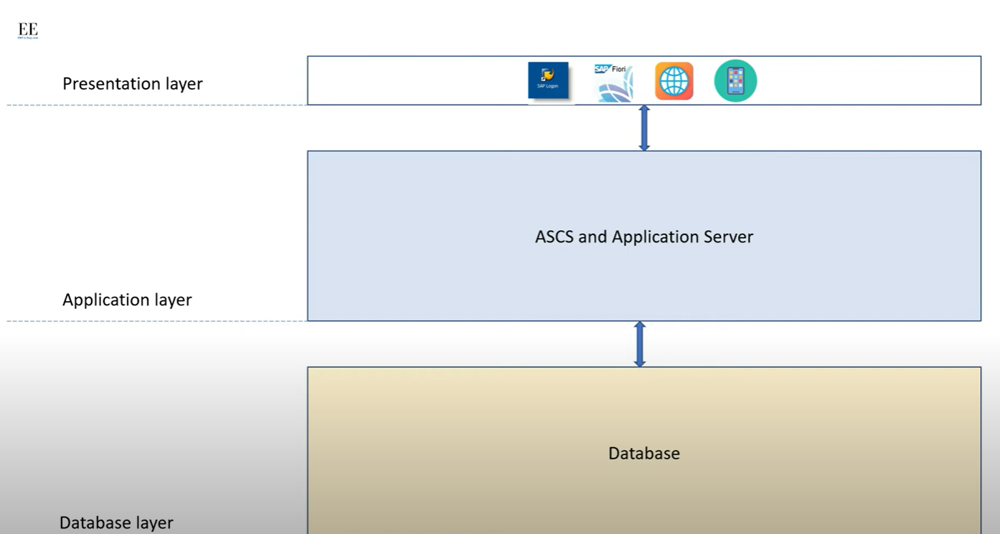

---

#### [M](https://github.com/ttltrk/TTT/blob/master/menu.md)

---

#### SAP

---

* [BASICS](#BASICS)
* [SYSTEM_KERNEL](#SYSTEM_KERNEL)
* [SAP_WORK_PROCESSES](#SAP_WORK_PROCESSES)
* [MAIN_TRANSACTIONS](#MAIN_TRANSACTIONS)
* [STOP/START/CHECK](#STOP/START/CHECK)
* [DB_LOGS](#DB_LOGS)
* [SYSTEM_PARAMETERS](#SYSTEM_PARAMETERS)
* [USER_ADMIN](#USER_ADMIN)
* [RFC](#RFC)
* [SYSTEM_SECURITY](#SYSTEM_SECURITY)
* [TRANSPORT](#TRANSPORT)
* [SUPPORT_PACKAGES](#SUPPORT_PACKAGES)
* [PRINTERS](#PRINTERS)
* [SCHEDULING](#SCHEDULING)
* [ARCHIVING](#ARCHIVING)
* [SYSTEM_MONITORING](#SYSTEM_MONITORING)
* [](#)
* [](#)
* [](#)
* [CLIENT_COPY](#CLIENT_COPY)
* [IXOS](#IXOS)
* [](#)

---

#### SAP

The SAP (comapny = SAP SE, Waldorf Germany) is a large company which is producing a large software (SAP ERP) and 
creates solutions that help to managing other companies more effectively. SAP is Leader in ERP.

- the company is SAP SE
- the product is SAP ERP, SAP CRM, SAP PLM, SAP BI 

SAP = Systems Applications and Products in data processing

ERP = ENterprise resource planning - vallalati eroforras tervezo. Kissebb koltseg nagyobb hatekonysag.

[^^^](#SAP)

---

#### BASICS

SAP system is one DB and one or more instances

[^^^](#SAP)

---

#### SAP_ARCHITECTURE

* [link](https://www.youtube.com/watch?v=xiWeo9rT2rU)

DB LAYER >> APPLICATION LAYER (ABAP or an ASCS and Application Server is located) >> PRESENTATION LAYER (users with SAP logon client, SAP business client)



ASCS = Central services systems 


enque server is responsible for managing locks 


- ICM = Internet communication manager (smtp and https)
- via Gateway SAP is able to communicate with other SAPs or non SAPs with RFC
- RFC = remote fucntion call 

##### Tranzakcio

Altalaban a tranzakcio olyan muvelet amelynek segitsegevel a felhasznalo valtozasokat vihet vegbe az adatbazisban.
Az egesz adatfolyam ami alkalmazasi modulokon fut keresztul, tranzakciok hasznalataval kerul feldolgozasra.
Egy tranzakcio feladata annak az infonak a modositasa amely vegul bekerul az adatbazisokba.

##### Dialoguslepes

Egy dialoguslepes egy SAP kepernyo amelyet egy dynpro reprezental. Egy dynpro vagyis dinamikus program, egy kepernyobol es
a hozzatartozo vegrehajtasi logikabol tevodik ossze.

##### LUW (Logical Unit of Work)

Egy luw nem mas mint egy tranzakcion beluli dialogus lepesek halmaza. Ezen lepeseknek helyesen vegre kell hajtodniuk hogy 
a tranzakcio tovabb haladhasson. Letezik DB tranzakcio, frissitesi tranzakcio, sap tranzakcio.

##### Kliensek

Definicioja szerint a kleins egy jogilag es szervezetileg is fuggetlen egyseg a SAPon belul. Ez lehet peldaul egy vallalati 
csoport, egy uzleti egyseg vagy testulet.

##### Rendszer kozponti interfeszei

- interfesz az OShez
- interfesz a DBhez
- prezentacios interfesz
- kommunikacios interfesz

##### Diszpecserfolyamat

A SAP dispatcher egy vezerlo program a WEB AS alkalmazasok eroforrasait kezeli. Tipikus tranzakcio-monitorkent mukodik. Kepernyoket
es adatokat kap a prezentacios szolgaltatoktol es azokat megfelelo munkafolyamatok fele tovabbitja.

##### Munkafolyamat 

Egy munkafolyamat egy szerver alatal nyujtott es egy kliens altal igenyelt szolgaltatas

- feladatkezelo :
	- abap processzor
	- dialogus ertelmezo
	- db interfesz

##### Munkafolyamatok tipusai

- dialogus mf: interaktiv feladatokat vegeznek el, a felhasznaloi input utan a dispatcher altal keresi sorokban tarolt jobok a kovetkezo
szabad munkafolyamatokhoz rendelodnek.
- hatterben futo mf: A hatterfeldolgozasra szant abap programokat a hatter munkafolyamatok tervezett idoben hajtjak vegre. fokent este
- spool mf: smf vegzi az adatok nyomtatas elotti formazasat valamint az adatok tovabbkuldeset a host-spoolrendszerre.
- sorkezelo mf (enque): a smf amelyeket a zartabla kozvetlen elerese miatt zarolasi mf-nek is neveznek a zarkezelo szerepet tolti be.
Biztositjak tobb alkalmazasszerver biztonsagos egyuttmukodeset: az adatbazi-eleres szinkronizalasat es az adatkonzistenciat megorzeset.
- frissitesi mf: feladata az adatbazis valtozasainak vegrehajtasa a hatter es dialogus mf igenyei szerint.

##### Uzenetszerver

Az uzenetszervert a kulonbozo alkalmazaszerverek hasznaljak adat es uzenetcserere. Nem rendelkezik a tipikus mf korabban leirt szerkezetevel,
sokkal inkabb hasonlit egy szolgaltatashoz.

##### Atjaroszerver

Az atjaroszerver teszi lehetove a web AS kulso alkalmazasok kozotti kommunikaciot. Ez a szolgaltatas egy CPIC kezelo amely implementalja a 
CPIC protokollt. KOzismert neve SAP atjarok (gateway)

- CPIC = Common Programming Interface Communication
- RFC = Remote Function Call - tavoli fuggveny hivas, egy szabvanyos programozasi interfesz amely a kulonbozo rendszerekben elhelyezkedo 
programok kozotti tavoli fuggvenyhivasok lebonyolitasara szolgal. Az RFC a CPIC-nel magasabb szintu logikai interfesz. Az SAP regota
ezt a programozasi interfeszt hasznalja a megegyezo vagy kulonbozo rendszerekben elhelyezkedo programok kozotti tavoli fuggvenyhivasra.

##### Prezentacios interfesz

##### Adatbazis interfesz

##### Kliens szerver

- Van a szolgaltatast kinalo (szerver) es a szolgaltatast igenylo (kliens) fogalmak. Egy program egyben lehet egyszerre szerver es kliens is.
Igy peldaul a SAP WEB AS tipikus alkalmazas szervere szolgaltatast nyujt a felhasznaloknak (SAP GUI) viszont az DB szervertol szolgaltatast
igenyel.

##### ITS = Internet Transaction Server

Az ITS koztes reteg lehetove teszi SAP Web AS forgatokonyvek bongeszobol torteno elereset, valamint fuggvenymodulok meghivasat URL-en
keresztul.

##### ICM = Internet Communication Manager

AZ ICM http, https es smtp protokollok hasznalataval biztositja a kommunikaciot az sap rendszer es a kulso vilag kozott. Szerver szerepkorben
fel tudja dolgozni az internet felol erkezo ezerver/port kombinacio hivo url-t tartalmazo kereseket amelyeket az ICM valosit meg. 

##### Profil

Az SAP rendszerekben a profil egy OS allomany amely egy peldany parametereit es konfig infoit tartalmazza. Lehet beloluk tobb. A profilok
a rendszer technikai es alapbeallitasanak alapveto reszei. Ertekeinek foleg a rendszer hangolasa eseten van hatalmas jelentoseguk.

```/usr/sap/<SID>/SYS/profile```

```/sapmnt/<SID>/profile ```

- inditasi profil
- alapertelmezett profil
- peldanyprofil

##### SAP NEWEAVER

- SN nyujtja as SAP uzleti megoldasok infrastrukturajahoz szukseges fo funkciokat. Az SN nyujtja a technikai keretrendszert a a mySAP ERP
komponense, a mySAP business suite es az xAppskent hivatkozott SAP osszetett alkalmazasi szamara. 


#####

#####

#####


[^^^](#SAP)

---

#### SYSTEM_KERNEL

[^^^](#SAP)

---

#### SAP_CLIENT

SAP client is a separate entity within a SAP system with its own master data,
transactional data and user master.

Data

- master data - data required by the business, to perform business (info about custmers, info about employees)
- transactional data - created and changed on the day to day basis, due to business operation (purchase orders, and sales orders)
- user master data - record the contains important user master data (name, email, groups, etd)

those data are client specific, only the dedicated clients can read and write
the above mentioned data

Type of clients 

- client 000 = golden client, which is used only for reference
- client 001 = client where config and program development are made
- client 100 = unit test client

000 - 999

more clients, means more hw resources

[^^^](#SAP)

---

#### SAP_WORK_PROCESSES

|Type|Use|Profile_param|
|----|---|-------------|
|DIA|dialogue requests|  |
|UPD|updates| |
|UPD2|less time critical update| |
|BGD|background jobs| |
|SPO|output requests| |
|ENQ|locks| |

[^^^](#SAP)

---

#### MAIN_TRANSACTIONS

use it with ```/n``` like ```/nsm37```

|transaction|description|
|-----------|-----------|
|SM04 / AL08|user overview/list|
|SE16| |
|SM50 / SM66|work processes|
|SM51|display application servers|
|SM36|define new jobs|
|SM37|background job overview|
|SU01|user roles/lock management|
|SM12|lock entries|
|SM13|update records|
|SM21|system log|
|SM02|send system messages|
|RZ20|profile maintenance/cross-system monitoring|
|SM59|rfc destinations|
|STMS|transport management system|
|SPAM|Import support packages|
|SAINT|Industry solution Install + upgrade|
|SPAD|Printer config| 
|SU01|User maintenance|
|SARA|Archiving|
|CCMS|Cross system alert monitoring|

[^^^](#SAP)

---

#### STOP/START/CHECK

WIN

from the Sap Service manager 

start: DB >> Central instance >> Other instances
stop: Other instances >> Central instance >> DB

```
Gray - not running
Yellow - is strating
Green - active
Red - terminated after errors
```

CMD

```
as <sid>adm

startsap <sid> [r3] [db] [all]
stopsap <sid>  [db] [r3] [all]
```

[^^^](#SAP)

---

#### DB_LOGS

```
\sapdb\data\wrk\<SID>
```

Oracle

```
\oracle\SID\saptrace\background\ALRT.log

\oracle\SID\sapreorg
\oracle\SID\sapcheck
\oracle\SID\sapbackup
```

[^^^](#SAP)

---

#### SYSTEM_PARAMETERS

rz20

```
Instance profile
Start profile
Default profile
```

[^^^](#SAP)

---

#### USER_ADMIN

```
Presentation server >> SAP Web AS (dispatcher+processes) >> DB server

Authorization profile
User Master records
```

[^^^](#SAP)

---

#### RFC

sm59

```
RFC = remote connections

RFC Destinations:

- r3 connections
- internal connections
- logical destinations
- sna/cpi-c connections
- tcp/ip connections
- abap/4 drivers
```

```
sRFC - synchronous
aRFC - asynchronous
tRFC - transactional
qRFC - queue(d)
```

[^^^](#SAP)

---

#### SYSTEM_SECURITY

```
SNC - Secure Network Communication
SSL - Secure Socket Layer 
SSF - Secure Store and Forward
```

SNC

```
SNC allows the encryption of the DIAG and RFC protocols
```

SSL

```
SSL allows the encryption of the HTTP protocol. this creates an HTTPS protocol from the HTTP.
```

SSF

```
SSF ensures that sap data and documents are secure during and beyond dialog transactions.
```

SAProuter

```
SAProuter is an SAP  program for forwarding SAP system connections through firewalls. Extend the firewalls 
but does not replace it.
```

[^^^](#SAP)

---

#### TRANSPORT

stms

Data Structure

```
Client >> Cross-client customizing >> Repository
```

```
DEV - QAS - PROD
```

```
tp addtobuffer EG3KT02778 EG3 u1 client500 pf=/usr/sap/trans/bin/TP_DOMAIN_PE1.PFL

tp import EG3KT02778 EG3 u1 client500 pf=/usr/sap/trans/bin/TP_DOMAIN_PE1.PFL

in se01 - logs - you can monitor the transport
```

[^^^](#SAP)

---

#### SUPPORT_PACKAGES

spam, saint

[^^^](#SAP)

---

#### PRINTERS

SPAD

```
local, remote 
```

[^^^](#SAP)

---

#### SCHEDULING

sm36

```
Reports to be run regularly and long-running programs are scheduled as background jobs in the SAP.
```

Step

```
ABAP program
external command
external program
```

Prio

```
A
B
C
```

Status

```
Scheduled >> Released >> Ready >> Active >> Finished/Canceled
```

[^^^](#SAP)

---

#### ARCHIVING

```
Consistent removal of data objects from database tables of the SAP system database, where all table entries
that characterize a data object are written to an archive file outside the database. Business consitency 
is ensured by SAP archiving programs that store all relevant table entries together on the basis of archiving
objects.
```

Steps

```
- Reorganization
- Backup / restore
- document storage (using SAP ArchiveLink)
- deletion of test data
```

Process

```
SAP DB >> Archiving object >> Archive files >> Offline storage
```

Archiving run

```
via transaction SARA

- Create an archiving variant
- Specify the execution user
- Specify the start time
- Define the spool parameters
```

[^^^](#SAP)

---

#### SYSTEM_MONITORING

[^^^](#SAP)

---

####

[^^^](#SAP)

---

####

[^^^](#SAP)

---

####

[^^^](#SAP)

---

####

[^^^](#SAP)

---

####

[^^^](#SAP)

---

####

[^^^](#SAP)

---

####

[^^^](#SAP)

---

####

[^^^](#SAP)

---

#### CLIENT_COPY

scc3, scc8

[link](https://drive.google.com/drive/u/1/folders/1KOvCfmQA2IdzWMxdQUfBCbnlcJE3Le2R)

[^^^](#SAP)

---

#### IXOS

```
mstsc ---> nts-admin / ---> LiveLink ---> dsadmin / ixosadm 

spawncmd stopall
ixos spawner - disable - stop
sql server (MSSQLSERVER, agent, fultext search, VSS writer) - stop

sql server start
ixos spawner - automatic - start
spawncmd statusall ---> if it is needed
```

```
spawncmd status
spawncmd -----> stopall
IXOS spawner - disabled - apply
check web

IXOS spawner - automatic - apply
spawncmd status

if it is possible
spawncmd ------> startall

check web
dbtest
```

[^^^](#SAP)

---

####

[^^^](#SAP)

---